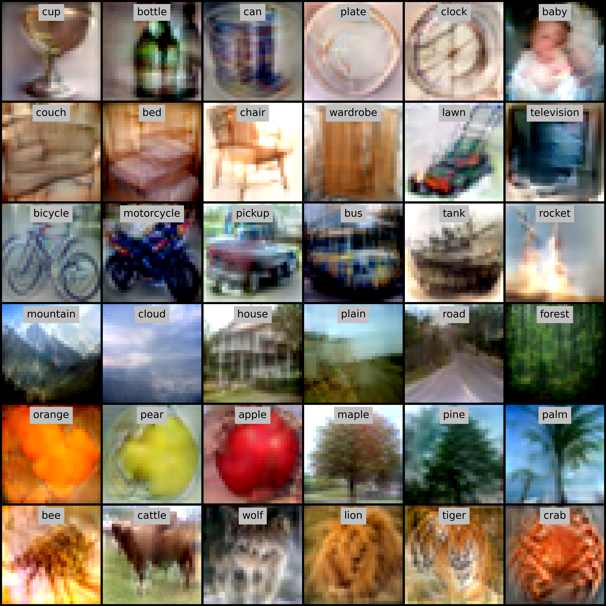
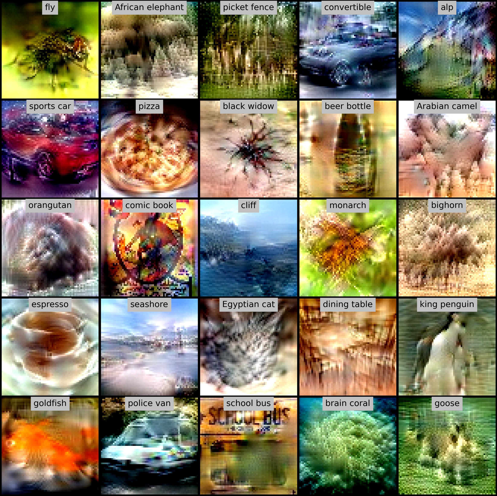
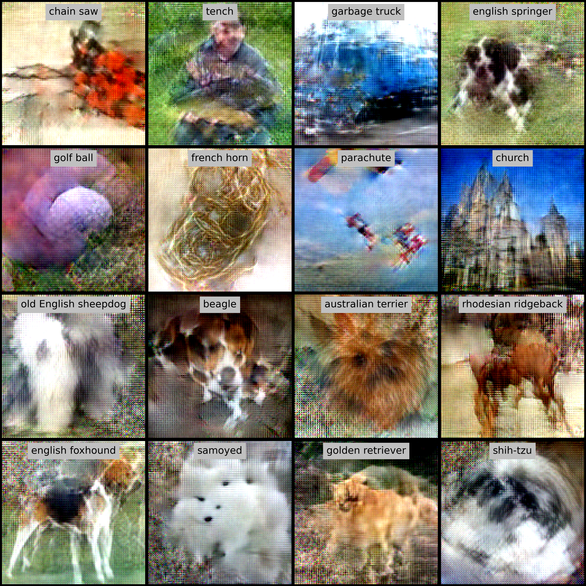

# Boosting Dataset Distillation with the Assistance of Crucial Samples for Visual Learning

This repo contains code for distilling dataset using infinite semantic augmentation. Please see our paper for more results.

<p align="middle">



</p>

## Abstract

In recent years, massive datasets have significantly driven the advancement of machine learning at the expense of high computational costs and extensive storage requirements. Dataset distillation (DD) aims to address this challenge by learning a small synthetic dataset such that a model trained on it can achieve a comparable test performance as one trained on the original dataset. This task can be formulated as a bi-level learning problem where the outer loop optimizes the learned dataset and the inner loop updates the model parameters based on the distilled data. Different from previous studies that focus primarily on optimizing the inner loop in this bi-level problem, we delve into the task of dataset distillation from the perspective of sample cruciality. We find that discarding easy samples and keeping the hard ones that are difficult to be represented by the learned synthetic samples in the outer loop can be beneficial for DD. Motivated by this observation, we further develop an Infinite Semantic Augmentation~(ISA) based dataset distillation algorithm, which discards some easier samples and implicitly enriches harder ones in the semantic space through continuously interpolating between two target feature vectors. Through detailed mathematical derivation, the joint contribution to training loss of all interpolated feature points is formed into an analytical closed-form solution of an integral that can be optimized with almost no extra computational cost. Experimental results on several benchmark datasets demonstrate the effectiveness of our approach in reducing the dataset size while preserving the accuracy of the model. Furthermore, we show that high-quality distilled data can also provide benefits to downstream applications, such as continual learning and membership inference defense.

## Getting Started

### Environment

- You can set up the environment using the command below.

```bash
conda env create -f environment.yaml
conda activate ISA

# Configure Environment Variable (Change to your own path)
export LD_LIBRARY_PATH=/scratch/ssd001/pkgs/cuda-11.3/lib64:/scratch/ssd001/pkgs/cudnn-11.4-v8.2.4.15/lib64:$LD_LIBRARY_PATH
export XLA_FLAGS=--xla_gpu_cuda_data_dir=/scratch/ssd001/pkgs/cuda-11.3 
export PATH=/scratch/ssd001/pkgs/cuda-11.3/bin:$PATH
```

## Dataset Distillation

### Train & Evaluate

- You can train and evaluate the distilled data using the following command.

```bash
path="--dataset_name=cifar10 --train_log=train_log --train_img=train_img --zca_path=data/zca --data_path=~/tensorflow_datasets --save_image=True"
exp="--learn_label=True --random_seed=0"
arch="--arch=conv --width=128 --depth=3 --normalization=batch"
hyper="--max_online_updates=100 --num_nn_state=10 --num_train_steps=500000"
ckpt="--ckpt_dir=train_log/cifar10/step500K_num100/conv_w128_d3_batch_llTrue/state10_reset100 --ckpt_name=best_ckpt --res_dir=dd/cifar10 --num_eval=5"
python -m script.distill $path $exp $arch $hyper --num_prototypes_per_class=10 --epsilon=0.5 --topk=0.8
python -m script.eval $ckpt $path $arch # Please do run this command since the arch is a little different. In the training, Conv-BN is adopted while it it Conv-NN during evaluation, as illustrated in the paper.
```

- Parameter Description
    - dataset_name:
      choice: ['cifar10', 'cifar100', 'mnist', 'fashion_mnist', 'tiny_imagenet', 'imagenet_resized/64x64, 'imagenette', 'imagewoof', 'caltech_birds2011']
    - data_path: path to dataset
    - zca_path: path to zca transformation matrix
    - train_log: directory holding tensorboard outputs and checkpoints
    - train_img: directory holding sampled distilled images
    - ckpt_dir: checkpoint directory
    - ckpt_name: checkpoint to evaluate. Choice: ['best_ckpt', 'proto', 'saved_ckpt']
    - res_dir: evaluation result output directory


### Applications

#### Continual Learning

```bash
path="--dataset_name=cifar100 --train_log=train_log/cl --train_img=train_img/cl --zca_path=data/zca --data_path=~/tensorflow_datasets --save_image=False"
exp="--learn_label=True --num_prototypes_per_class=20"
arch="--arch=conv --width=128 --depth=3 --normalization=batch"
hyper="--max_online_updates=100 --num_nn_state=10 --num_train_steps=500000"
ckpt="--ckpt_dir=train_log/cl/cifar100 --ckpt_name=best_ckpt --res_dir=cl/cifar100 --num_eval=5 --num_online_eval_updates=10000"
cl_steps=5

for seed in {0..4}
do
  for ((idx=0; idx<$cl_steps; idx++))
  do 
    python -m script.distill_cl $path $exp $arch $hyper --cl_steps=$cl_steps --cl_step_idx=$idx --cl_seed=$seed --epsilon=0.5 --topk=0.8
  done
done

for seed in {0..4}
do
  for ((idx=0; idx<$cl_steps; idx++))
  do 
    python -m script.eval_cl $ckpt $path $arch --use_cl=True --cl_steps=$cl_steps --cl_step_idx=$idx --cl_seed=$seed
  done
done
```

#### Membership Inference Defense

```bash
path="--train_log=train_log/mia --train_img=train_img/mia --zca_path=data/zca --data_path=~/tensorflow_datasets --save_image=False"
exp="--dataset_name=mnist --num_prototypes_per_class=50 --learn_label=True --random_seed=0 --res_dir=mia/mnist/summary"
arch="--arch=conv --width=128 --depth=3 --normalization=batch"
hyper="--max_online_updates=100 --num_nn_state=10 --num_train_steps=500000"
chunk_num=5
chunk_size=10000

for ((idx=0; idx<$chunk_num; idx++))
do 
  python -m script.mia $path $exp $arch $hyper --chunk_size=$chunk_size --chunk_idx=$idx --epsilon=0.5 --topk=0.8
done
```

## Acknowledgements
We appreciate the open source of [FRePo](https://github.com/yongchao97/FRePo).
